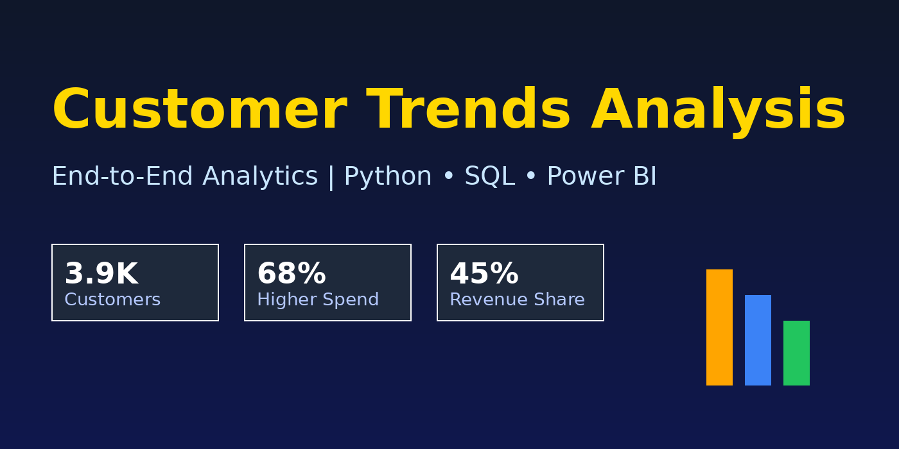
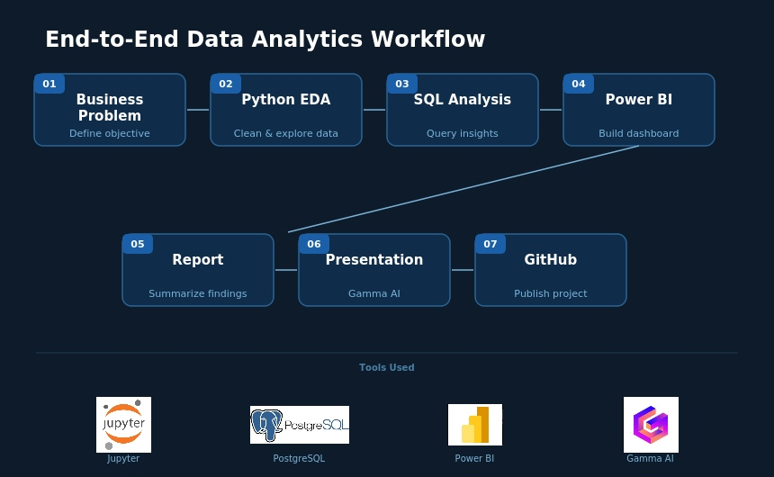

# 👨🏻‍💻 Customer Trends Analysis | End-to-End Data Analytics Project

<div align="center">



</div>

---

## 📌 Overview

This project demonstrates a complete **end-to-end data analytics pipeline** using customer transaction data to extract actionable business insights.

The dataset contains **3,900 customer transactions** with **18 features**, including demographics, purchasing behavior, and engagement metrics.

---

## ⚙️ Project Workflow

<div align="center">



</div>

---

## 🎯 Business Objective

 - 🔹 Identify high-value customers
 - 🔹 Analyze revenue drivers
 - 🔹 Understand purchasing patterns
 - 🔹 Improve customer retention strategies

---

## 🛠️ Tech Stack

| Layer | Tools |
|-------|-------|
| Data Exploration (EDA) | Python (Jupyter Notebook) |
| Database | PostgreSQL |
| Visualization | Power BI |
| Presentation | Gamma |
| Documentation | Microsoft Word |

---

## 🔍 Key Analysis Performed

### 📊 Data Preparation & EDA
- Data cleaning and preprocessing
- Missing value treatment *(Review Rating imputation)*
- Feature engineering *(Age Groups, Purchase Frequency)*
- Data standardization

### 🧠 SQL Analysis
- Revenue analysis by gender
- High-spending discount users
- Top-rated products
- Shipping type impact
- Subscription vs non-subscription analysis
- Customer segmentation *(New, Returning, Loyal)*
- Repeat purchase behavior
- Revenue contribution by age group
---

## 📈 Key Insights

- ✅ Female customers generate slightly higher revenue
- ✅ Express shipping users spend **~12% more**
- ✅ Subscribers show significantly higher engagement
- ✅ High-value customers strategically use discounts
- ✅ Certain product categories dominate repeat purchases

---

## 📊 Key Findings

| Metric | Finding |
|--------|---------|
| 📌 Revenue from Subscribers | ~45% of total revenue |
| 📌 Subscriber Spending | ~68% higher than non-subscribers |
| 📌 Repeat Customer Loyalty | ~78% loyalty rate |
| 📌 New Customer Segment | Majority are "New" → conversion opportunity |

---

## 🧩 Business Recommendations

| # | Recommendation |
|---|----------------|
| 1 | 🚀 Boost subscription programs |
| 2 | 🎯 Target high-value customers |
| 3 | 💡 Optimize discount strategy |
| 4 | 🛒 Promote top-performing products |
| 5 | 🔄 Improve customer retention strategies |

---

## ▶️ How to Run
```bash
# Step 1 — Open Jupyter Notebook
jupyter notebook Customer_Shopping_Behavior_Analysis.ipynb

# Step 2 — Perform EDA & data cleaning
# (Follow the notebook cells)

# Step 3 — Load data into PostgreSQL
# (Run the data loading cells in the notebook)

# Step 4 — Run SQL queries
# Open customer_behavior_sql_queries.sql in your SQL client

# Step 5 — Open Power BI Dashboard
# Open customer_behavior_dashboard.pbix in Power BI Desktop

# Step 6 — Review insights & report
```

---

## 📁 Project Structure
```
📦 Customer-trends-Analysis-Python-SQL-Power-BI
 ┣ 📓 Customer_Shopping_Behavior_Analysis.ipynb
 ┣ 🗃️  customer_behavior_sql_queries.sql
 ┣ 📊 customer_behavior_dashboard.pbix
 ┣ 📄 Project_Report.pdf
 ┣ 🎨 Presentation.pdf
 ┣ 🖼️  Cover_Image_CTA.png
 ┣ 🖼️  Project_Workflow_Diagram.jpg
 ┗ 📖 README.md
```

---

## 📬 Connect

[](https://linkedin.com/in/your-profile)
[](mailto:your-email@gmail.com)

---

## ⭐ Support

If you found this project useful, consider giving it a ⭐ — it means a lot!

---

<div align="center">

*Made with ❤️ using Python • SQL • Power BI • Gamma AI*

</div>
